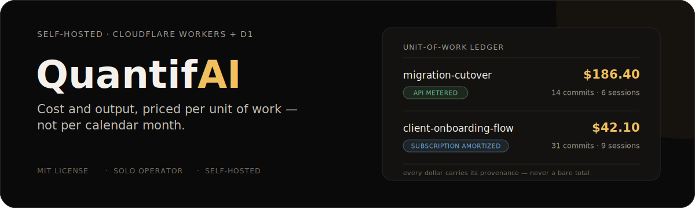
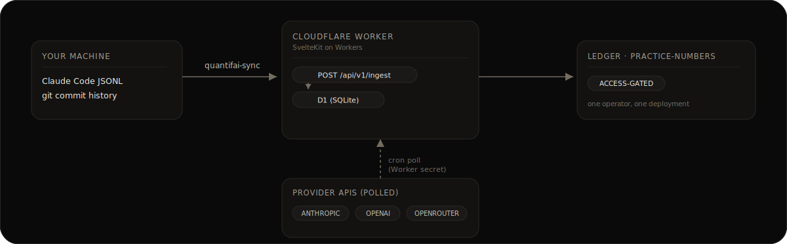

<p align="center">
  
</p>

If you run Claude Code, Cursor, Copilot, or ChatGPT across a lot of projects, every one of those tools will tell you what you spent this month. None of them will tell you what a given piece of work actually cost, blended across your subscriptions and metered API usage. QuantifAI is a self-hosted instrument for answering that question, built by a solo operator for solo operators.

## Status

This is a personal dogfood tool, not a hosted product. It's built for exactly one person per deployment — there's no sign-up flow and no multi-tenant account system. If you want to use it, you deploy your own copy to your own Cloudflare account with your own provider keys. See [`decisions/`](decisions) for the full reasoning trail (this project runs on the [Blueprint](https://github.com/nino-chavez/blueprint) methodology, so every non-obvious call is recorded as an ADR, including the ones that got reversed).

## Why per unit of work, not per month

Provider dashboards and tools like `ccusage` answer "what did I spend this month." That's the wrong denominator for someone whose work is organized into initiatives and projects, not calendar time. QuantifAI's ledger answers "what did *this* initiative cost, across every provider, subscription and API combined — and what did it produce (commits, deploys, sessions)." Every dollar figure carries a provenance badge (`subscription_amortized` / `api_metered` / `estimated`) so blended totals are never presented as more precise than they are.

## How it flows

<p align="center">
  
</p>

- **Runtime**: SvelteKit on Cloudflare Workers
- **Data**: Cloudflare D1 (SQLite)
- **Auth**: Cloudflare Access (single user, gated at the edge — no in-app login)
- **Provider credentials**: Worker secrets (`wrangler secret put`), not a database table — there's exactly one user, so there's nothing to encrypt-and-rotate through a UI
- **Ingestion**: the [`quantifai-sync`](https://github.com/nino-chavez/quantifai-sync) shipper daemon watches your local Claude Code JSONL and git activity, and POSTs to your deployment's ingest endpoint

Full rationale for each of these calls: [`decisions/0004`](decisions/0004-architecture-posture.md) (architecture posture), [`decisions/0005`](decisions/0005-hosting-pure-cloudflare.md) (why Cloudflare over Supabase/Vercel), [`decisions/0006`](decisions/0006-provider-secrets-worker-secrets-not-byok-db.md) (why no credential table).

## Self-hosting

Full setup, ingestion, deploy, and Cloudflare Access configuration steps live in [`apps/app/README.md`](apps/app/README.md). Short version:

```bash
npm install
cd apps/app
npm run db:migrate:local   # local D1 via wrangler, no Docker/Supabase needed
npm run dev                # http://localhost:5173
```

Deploying your own instance means: a Cloudflare account, `wrangler deploy`, your own provider API keys as Worker secrets, and (optionally) the [`quantifai-sync`](https://github.com/nino-chavez/quantifai-sync) shipper installed on each machine you work from — installable via the [Homebrew tap](https://github.com/nino-chavez/quantifai-homebrew-tap).

## Companion repos

| Repo | What it is |
|---|---|
| [`quantifai-sync`](https://github.com/nino-chavez/quantifai-sync) | Go telemetry shipper daemon — watches local JSONL/git activity, POSTs to your deployment |
| [`quantifai-homebrew-tap`](https://github.com/nino-chavez/quantifai-homebrew-tap) | `brew install` distribution for `quantifai-sync` |

## Repo layout

```
apps/
  app/      — the product: SvelteKit app, D1 migrations, provider adapters, importers
  portal/   — Blueprint methodology portal (decisions/research browser — optional, not the product)
packages/
  ui/, design-tokens/  — shared components for the portal
  gate-derive/         — Blueprint build tooling
decisions/  — ADRs: every non-obvious call and why, including reversed ones
research/   — competitive analysis, persona, and codebase-inheritance research
prototype/  — DESIGN.md: the visual and product rules the app implements
```

## License

MIT — see [`LICENSE`](LICENSE).
